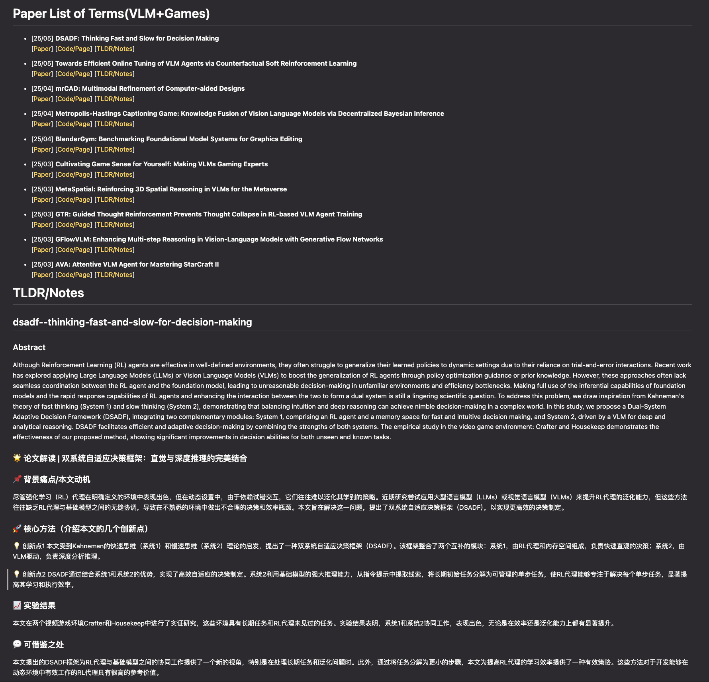
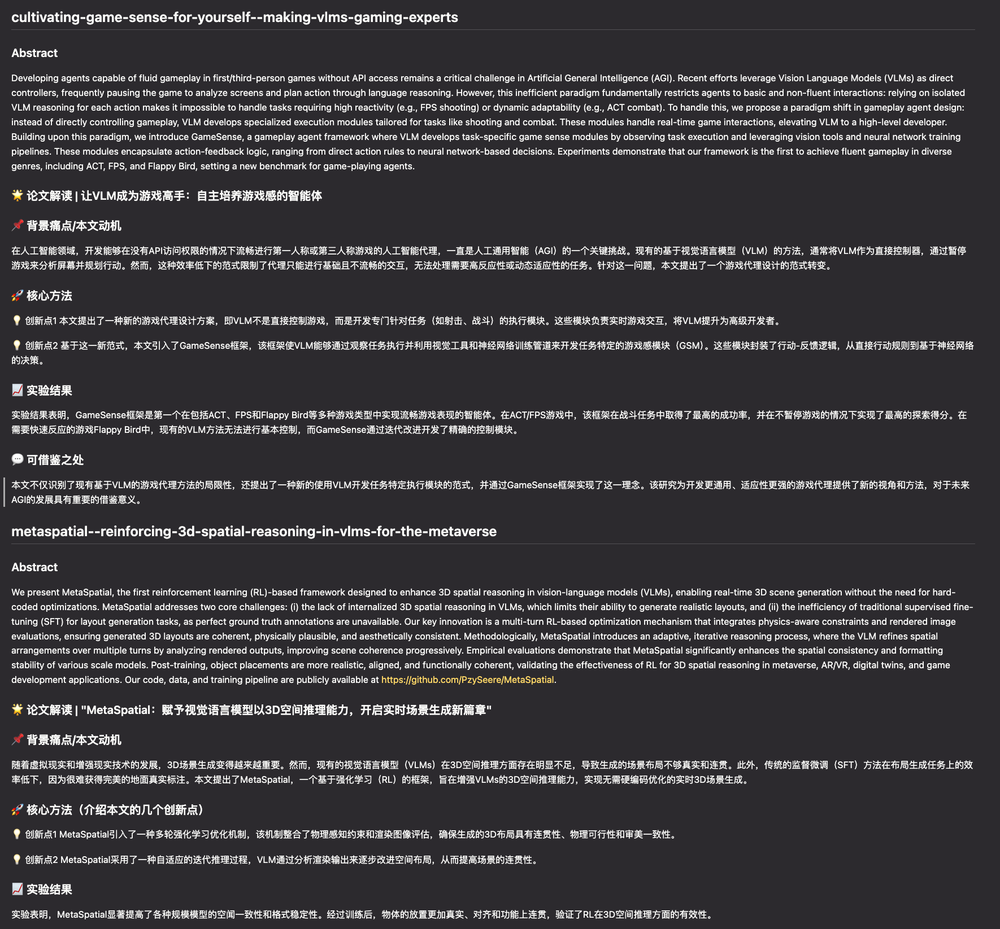

# 📚 Survey Agent

A modern framework for automatically generating research surveys by searching arXiv papers, downloading them, and using LLMs to summarize their content. Perfect for researchers, students, and anyone who wants to stay up-to-date with the latest research! ✨

## ✅ Features

- 🔍 Search arXiv papers by keywords or specific titles
- 📚 **NEW**: Generate surveys from BibTeX (.bib) files
- 📥 Download PDFs and extract text content
- 🤖 Generate summaries of papers using LLMs (supports various models including GLM-4)
- 🎯 **NEW**: Custom prompt templates for personalized summarization
- 📁 **NEW**: Intelligent caching system for 200-1000x speedup on repeated queries
- 🖥️ **NEW**: PDF and Notes Viewer - Browse cached PDFs with interactive interface
- ❓ **NEW**: Batch Q&A - Ask the same question to multiple papers simultaneously
- 📝 Create well-formatted markdown surveys with paper lists and summaries
- 🚀 Simple and intuitive API
- 🌐 Support for both web interface and Python API

## 🛠️ Installation

```bash
git clone https://github.com/linjh1118/survey_agent.git
cd survey_agent
pip install -e .
```

## 🚀 Quick Start

### 1. Using Web Interface (Recommended)

#### Standard Search Interface

The easiest way to get started is using our interactive web interface:

```bash
streamlit run src/survey_agent/frontend.py
```

#### **NEW**: BIB File Interface

For generating surveys from existing BibTeX files:

```bash
streamlit run src/survey_agent/frontend_by_bib.py
```

This new interface allows you to:

- Upload BibTeX files and automatically parse paper information
- Preview parsed papers before processing
- Choose from multiple prompt templates or create custom ones
- Generate surveys with personalized summarization styles

📺 **User Case**

<table>
  <tr>
    <td align="center">🎥 Survey on KeyWords</td>
    <td align="center">🎥 Survey on Bib</td>
  </tr>
  <tr>
    <td align="center"><video src="https://github.com/user-attachments/assets/c6af0ce3-c051-4e03-9686-c151a37ba364" width="100" controls preload></video></td>
    <td align="center"><video src="https://github.com/user-attachments/assets/fd5a04e4-1372-41ec-9d3d-42259c12446e" width="100" controls preload></video></td>
  </tr>
</table>

<video width="100%" controls>
  <source src="output/demo.mp4" type="video/mp4">
  Your browser does not support the video tag.
</video>

### 2. **NEW**: PDF and Notes Viewer

Experience our new interactive PDF and notes management interface:

```bash
./launch_pdf_viewer.sh
# Or manually: python3 pdf_api.py
```

Then visit: http://localhost:8002/pdf_viewer.html

**Features:**
- 📋 **View All Cached PDFs**: Browse your downloaded papers with rich metadata
- 📄 **Rich Summary Display**: View AI-generated summaries in beautifully formatted pages
- 🎨 **Markdown Rendering**: Full markdown support with syntax highlighting and formatting
- 🔍 **Smart Search & Filter**: Search by title/content, filter by status, sort by date
- ✅ **Multi-select Papers**: Select multiple papers for batch operations  
- ❓ **Batch Q&A**: Ask the same question to selected papers simultaneously
- 📊 **Statistics Dashboard**: Track your paper collection and cache status
- 💾 **Auto-save Results**: All Q&A responses saved as structured Markdown files
- 📤 **Export & Share**: Copy, export, email, or print summaries with one click

**Perfect for:**
- Literature review sessions
- Comparative analysis across papers
- Finding common themes in research
- Quick reference to your paper collection

### 3. Using Python API

#### Standard Search API

```python
import os
os.environ.update({"https_proxy": "http://127.0.0.1:7890", "http_proxy": "http://127.0.0.1:7890"})
os.environ.update({"API_KEY": "your_api_key_here", "BASE_URL": "your_api_url"})

from survey_agent.survey import generate_survey

generate_survey(
    terms=["VLM", "Games"],
    max_results=10,
    output_file="output/vlm_games_survey.md",
    model_name="glm-4-air"
)
```

#### **NEW**: BIB File API

```python
import os
from survey_agent.survey import generate_survey_from_bib

# Set environment variables
os.environ.update({"API_KEY": "your_api_key_here", "BASE_URL": "your_api_url"})

# Generate survey from BIB file
generate_survey_from_bib(
    bib_file="path/to/your/bibliography.bib",
    output_file="output/survey_from_bib.md",
    model_name="glm-4-air"
)
```

#### **NEW**: Custom Prompt API

```python
# Define your custom prompt template
custom_prompt = """### Task
Analyze the following paper and provide insights for {title}.

### Paper Info
Title: {title}
Authors: {authors}
Abstract: {abstract}
Full Text: {pdf_text}

### Analysis
Please provide:
1. Main contributions
2. Technical approach
3. Experimental results
4. Future work suggestions
"""

# Use with standard search
generate_survey(
    terms=["AI", "Machine Learning"],
    custom_prompt=custom_prompt,
    output_file="output/custom_survey.md"
)

# Or use with BIB file
generate_survey_from_bib(
    bib_file="papers.bib",
    custom_prompt=custom_prompt,
    output_file="output/custom_bib_survey.md"
)
```

## 🆕 New Examples

### 1. BIB File Processing

```bash
python examples/generate_survey_by_bib.py
```

This example demonstrates:

- Loading papers from a BibTeX file
- Using different prompt templates (default, academic analysis, English)
- Generating multiple survey versions with different styles

### 2. Custom Prompt Templates

Available placeholders for custom prompts:

- `{title}` - Paper title
- `{abstract}` - Paper abstract
- `{authors}` - Author information
- `{year}` - Publication year
- `{url}` - Paper URL
- `{pdf_text}` - Paper full text (truncated)
- `{full_pdf_text}` - Complete paper text
- `{doi}` - DOI information
- `{arxiv_id}` - arXiv ID

## 🏃🏻‍♀️🏃🏻‍♀️

 If you `python examples/generate_survey.py`, you will get `output/vlm_games_survey.md`
--> check [output/vlm_games_survey.md](output/vlm_games_survey.md) . The log is at [output/vlm_games_survey.log](output/vlm_games_survey.log).

<table>
  <tr>
    <td></td>
    <td></td>
  </tr>
  <tr>
    <td align="center">Page1</td>
    <td align="center">Page2 of survey</td>
  </tr>
</table>

## 📊 Some Details

### Standard Workflow

Running the example script `（python examples/generate_survey.py`） will:

1. Search arXiv for papers matching the keywords "VLM" and "Games"
2. Download the top 10 papers as PDFs to the `pdfs/` directory
3. Generate a comprehensive survey in `output/vlm_games_survey.md`

### **NEW**: BIB File Workflow

Running `python examples/generate_survey_by_bib.py` will:

1. Parse the provided BibTeX file and extract paper metadata
2. Filter papers that have arXiv IDs for PDF download
3. Download and process the papers
4. Generate surveys using different prompt templates
5. Create multiple output files showcasing different summarization styles

The generated survey includes:

- A list of all papers with links to the original papers
- TLDR/Notes section with detailed summaries of each paper
- Paper abstracts and key insights

## 🏗️ Project Structure

```
survey_agent/
├── examples/                    # Example usage scripts
│   ├── generate_survey.py       # Standard search example
│   └── generate_survey_by_bib.py # NEW: BIB file example
├── output/                      # Generated survey markdown files
├── pdfs/                        # Downloaded paper PDFs
├── cache/                       # NEW: Intelligent caching system
│   ├── README.md                # Cache documentation
│   └── paper_summaries.json     # Cached paper summaries
├── pdf_viewer.html              # NEW: PDF and Notes Viewer interface
├── summary_view.html            # NEW: Individual summary display page  
├── pdf_api.py                   # NEW: PDF Viewer backend API
├── launch_pdf_viewer.sh         # NEW: PDF Viewer launcher script
├── test_summary_view.html       # NEW: Testing page for summary features
└── src/
    └── survey_agent/
        ├── arxiv_tools/         # ArXiv search and download functionality
        │   ├── search.py        # Search papers on arXiv
        │   └── download.py      # Download PDFs from arXiv
        ├── llm/                 # LLM integration for summarization
        │   └── summarize.py     # NEW: Enhanced with custom prompts & caching
        ├── utils/               # Utility functions
        │   ├── bib_parser.py    # NEW: BibTeX file parser
        │   └── cache.py         # NEW: Intelligent caching system
        ├── survey/              # Survey generation tools
        │   └── generator.py     # Generate markdown surveys
        ├── frontend.py          # Standard web interface
        └── frontend_by_bib.py   # NEW: BIB file web interface
```

## ⚙️ Configuration

You can configure the LLM used for summarization by setting environment variables:

```python
# Set the LLM API key and base URL
import os
os.environ["API_KEY"] = 'your_api_key_here'
os.environ["BASE_URL"] = 'https://open.bigmodel.cn/api/paas/v4/'
```

## 🙋‍♂️ Contributing

Contributions are welcome! Feel free to open an issue or submit a pull request if you have any improvements or bug fixes.

Contributors:

<a href="https://github.com/linjh1118/survey_agent/graphs/contributors">
  
</a>

## 📜 License

MIT

## 🖥️ Frontend Interfaces

### Standard Interface

```bash
streamlit run src/survey_agent/frontend.py
```

**Features:**

- Search by keywords
- Real-time progress tracking
- Download in markdown and HTML formats

### **NEW**: BIB File Interface

```bash
streamlit run src/survey_agent/frontend_by_bib.py
```

**Features:**

- Upload and parse BibTeX files
- Preview parsed papers
- Multiple prompt template options
- Custom prompt editor with placeholder support
- Real-time template preview

### **NEW**: PDF and Notes Viewer

```bash
./launch_pdf_viewer.sh
```

**Features:**

- Interactive PDF library management
- Advanced search and filtering capabilities
- Multi-select batch operations
- Batch Q&A with automatic result saving
- Real-time statistics and progress tracking

### 功能说明

#### 标准界面功能

- 输入关键词，自动检索、下载、总结论文并生成综述
- 实时展示进度和已查到的论文标题
- 支持下载 markdown 和 html 格式的综述

#### **新增**: BIB文件界面功能

- 上传BibTeX文件，自动解析论文信息
- 预览解析结果，显示可处理的论文数量
- 选择预设模板或自定义Prompt进行个性化总结
- 支持多种总结风格：默认、学术分析、英文简洁、自定义
- 实时预览Prompt模板和占位符说明

## 🔥 Advanced Features

### 📁 Intelligent Caching System

Survey Agent features an advanced caching system that dramatically improves performance for repeated queries:

- **Automatic Caching**: Paper summaries are automatically cached based on arxiv.id
- **Smart Content Detection**: Uses content hashing to detect paper changes
- **Instant Results**: Cached papers load in milliseconds instead of seconds
- **30-Day Auto-Expiry**: Keeps cache fresh while maintaining performance
- **200-1000x Speedup**: Repeated queries are nearly instantaneous

```python
# First run: Downloads and processes papers (normal speed)
generate_survey(terms=["AI", "Machine Learning"], max_results=10)

# Second run: Uses cache (lightning fast!)
generate_survey(terms=["AI", "Machine Learning"], max_results=10)
```

**Cache Statistics**: View cache performance with built-in stats:

```python
from survey_agent.utils.cache import get_paper_cache
cache = get_paper_cache()
print(cache.get_cache_stats())
```

For detailed implementation and features, see [`cache/README.md`](cache/README.md).

### Custom Prompt Templates

Create personalized summarization styles by using custom prompts with placeholders:

#### Academic Analysis Template

```
### 任务
你是一个AI研究专家，请对以下论文进行专业的学术分析。

### 论文信息
标题: {title}
作者: {authors}
年份: {year}
摘要: {abstract}

### 输出格式
## 📊 论文深度分析 | {title}
## 🎯 研究问题与动机
## 🔬 核心技术方法
## 📈 实验设计与结果
## 💡 优势与局限性
## 🔮 未来研究方向
```

#### English Concise Template

```
### Task
Analyze the following paper: {title}

### Paper Information
Authors: {authors}
Abstract: {abstract}
Full Text: {pdf_text}

### Output
## 📄 Paper Summary
## 🎯 Problem & Motivation
## 🛠️ Method
## 📊 Experiments  
## 💭 Takeaways
```

### BibTeX File Support

The system automatically:

- Parses standard BibTeX format
- Extracts arXiv IDs from URLs and DOIs
- Filters papers available for download
- Handles various field formats (braces, quotes)
- Supports multi-line values

**Supported BibTeX Entry Types:**

- `@article`
- `@inproceedings`
- `@misc`
- `@techreport`
- And more...

### Error Handling & Robustness

- Graceful handling of malformed BibTeX entries
- Automatic fallback for papers without arXiv IDs
- Retry mechanisms for PDF downloads
- Progress tracking for long-running operations
- Detailed error reporting

## 🛠️ Installation & Dependencies

### Required Dependencies

```bash
pip install streamlit
pip install openai
pip install requests
pip install pandas
pip install tqdm
pip install markdown
```

### Optional Dependencies

```bash
pip install bibtexparser  # Alternative BibTeX parser
pip install PyPDF2        # Alternative PDF processor
```

## 📈 Performance & Scalability

- **Parallel Processing**: Multiple papers processed simultaneously
- **Memory Efficient**: PDF text truncation for large documents
- **Progress Tracking**: Real-time updates during processing
- **Error Recovery**: Continues processing even if individual papers fail
- **Customizable Limits**: Configurable PDF text length and processing timeouts
